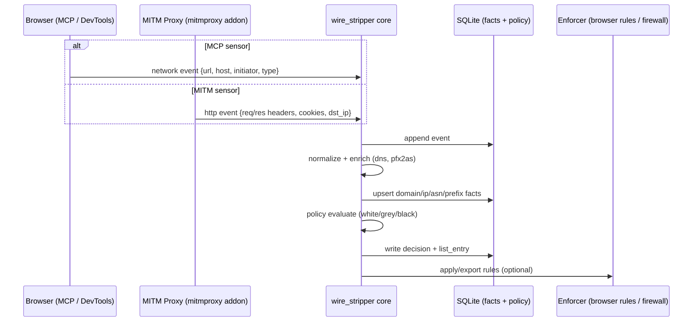

# wire_stripper

Local egress/ingress control + ASN/BGP intelligence + federated lists.

This repo consolidates:
- DMBT-style domain→IP→ASN→prefix mapping and prefix-block export
- Privacy Proxy-style request/cookie/fingerprint stripping (mitmproxy addon)
- MCP browser tool-plane integration (Claude-in-Chrome style), so browser activity becomes a structured sensor feeding the same policy engine

## Quick start (dev)

```powershell
uv venv .venv
.venv\Scripts\activate.ps1
uv pip install -r requirements.txt

# init unified DB
python -m wire_stripper --root .\data db init

# ETL into canonical tables (Phase 1)
python -m wire_stripper --root .\data etl --profile default import-all
```

## What you get

- One unified SQLite backend (canonical + legacy co-located)
- Pluggable sensors: `mitmproxy`, `mcp_browser` (ingest), `os_flow` (future)
- Policy engine producing per-profile allow/grey/deny list entries
- ETL mode: import DMBT + Privacy Proxy tables into canonical facts
- Export adapters: hosts-style, chrome rules, firewall prefix plans (dry-run)

## Docs

- Narrative: `docs/narrative.md`
- Diagrams: `docs/diagrams.md`
- Architecture: `docs/architecture.md`

## Architecture (swimlanes)



More diagrams and detailed spec: `docs/architecture.md`.
