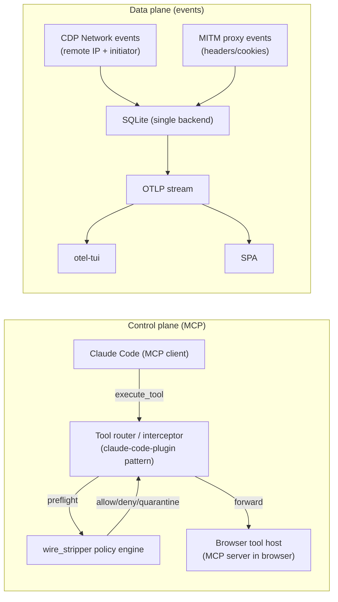
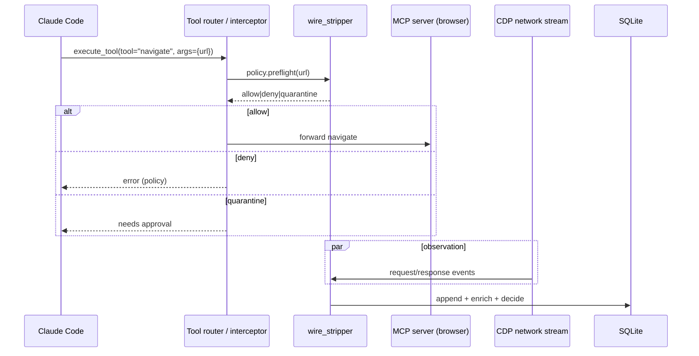

# wire_stripper — control your firehose (MCP-in-browser × DMBT × Privacy Proxy)

This is the public-facing conceptual contract for wire_stripper.

Core idea: Claude-in-Chrome is an MCP server inside the browser boundary. If you control the tool router (MCP interception), you control intent, context, and the resulting network graph. That is strictly more powerful than a proxy-only design.

## Canonical system writeup

(Kept in-repo at `docs/WIRE_STRIPPER_APP.md`.)

---

## Architecture diagrams

## Repo

Local consolidated repo:
- `D:\somacosf\outputs\wire_stripper`

Public gist URL:
- https://gist.github.com/SoMaCoSF/b03c3bf0ba9e98c063eba9ca8cc73bfb
