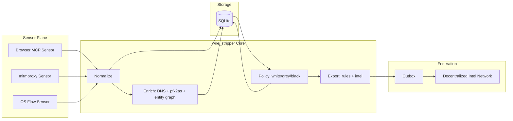
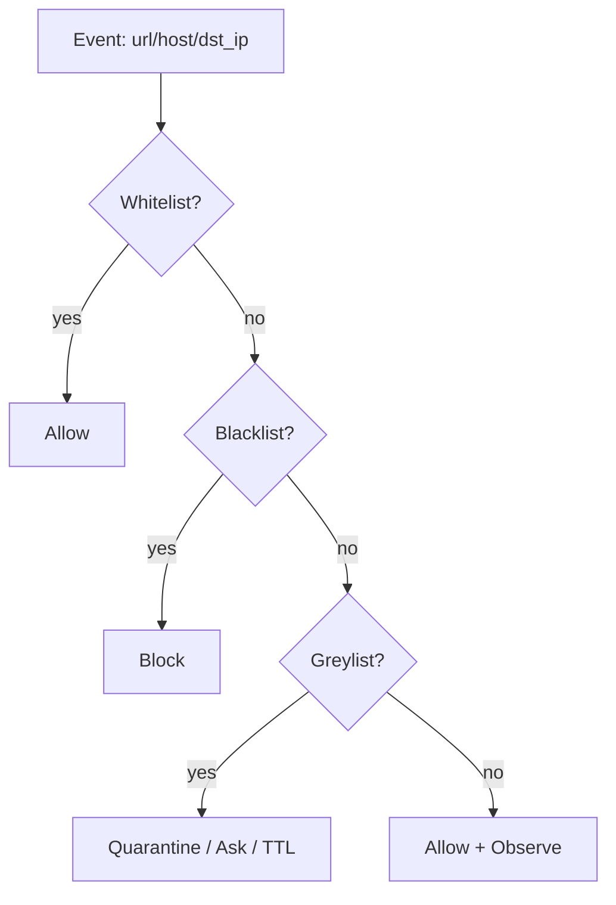

# Architecture

## User story (why this matters)

You don’t want to “block ads”. You want to **control your firehose**.

Wire stripping means:
- every network touch becomes an attributable, explainable *fact*
- every fact is enriched into **who really owns this pipe** (domain → IP → ASN → prefix → entity)
- every policy action is staged (allow/grey/deny) and reversible
- every decision is exportable to enforcement layers (browser, proxy, OS)
- every safe-to-share discovery becomes part of a **decentralized ASN/BGP intelligence commons**

## Swimlane: data plane + control plane

## Filter logic precedence

## Notes on viability

- Real-time IP→ASN must use local pfx2as LPM; per-IP whois does not scale.
- Prefix/ASN enforcement must be staged to avoid collateral damage.
