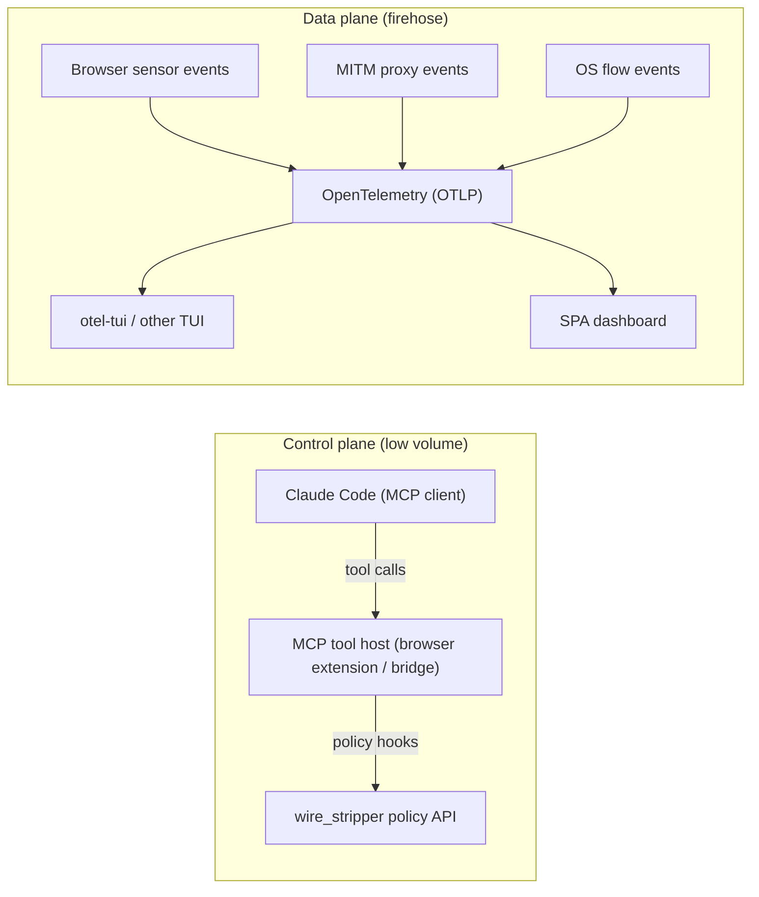
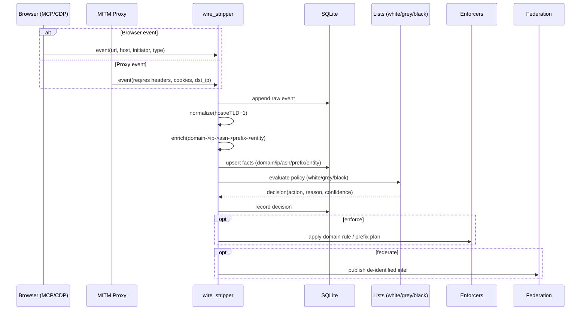
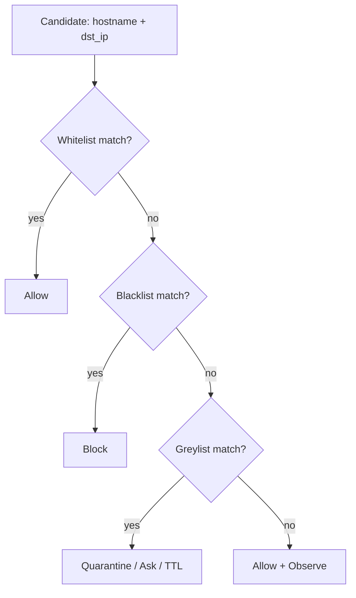
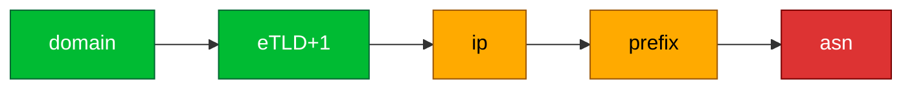
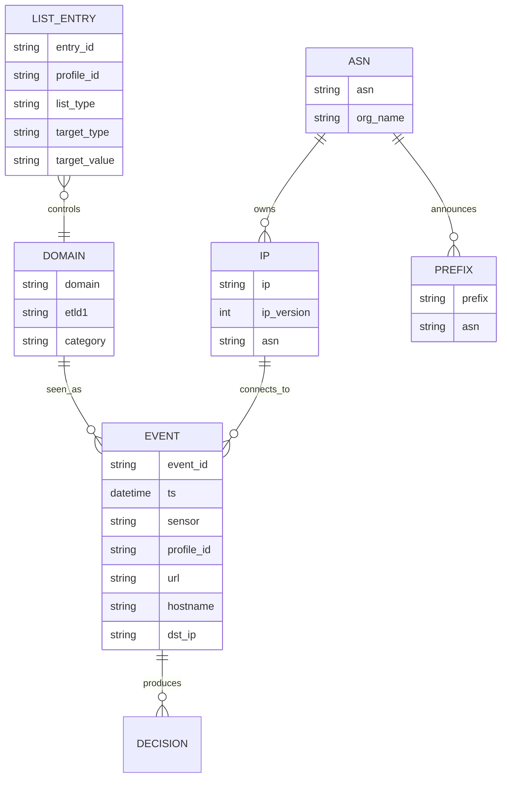
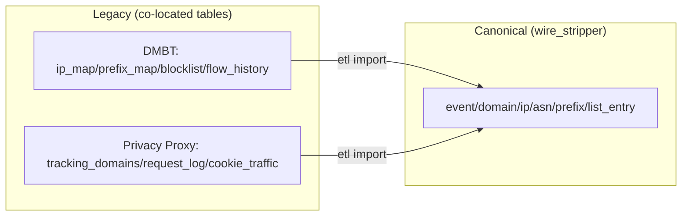

# Diagrams

## 1) Control plane vs data plane

## 2) End-to-end wire stripping (swimlane)

## 3) Policy precedence

## 4) Escalation ladder (avoid collateral damage)

## 5) Data model (canonical + legacy co-located)

## 6) ETL mode flow

