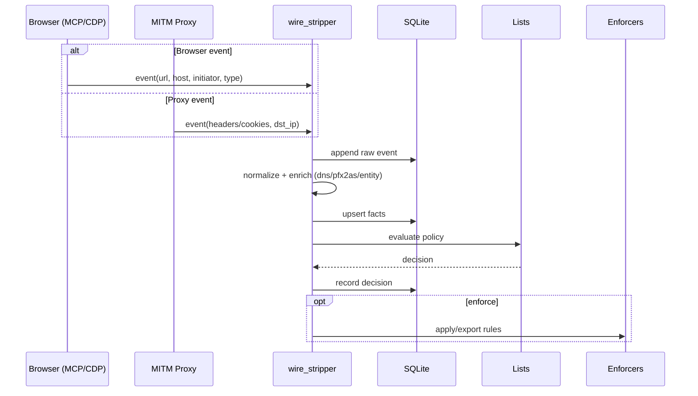
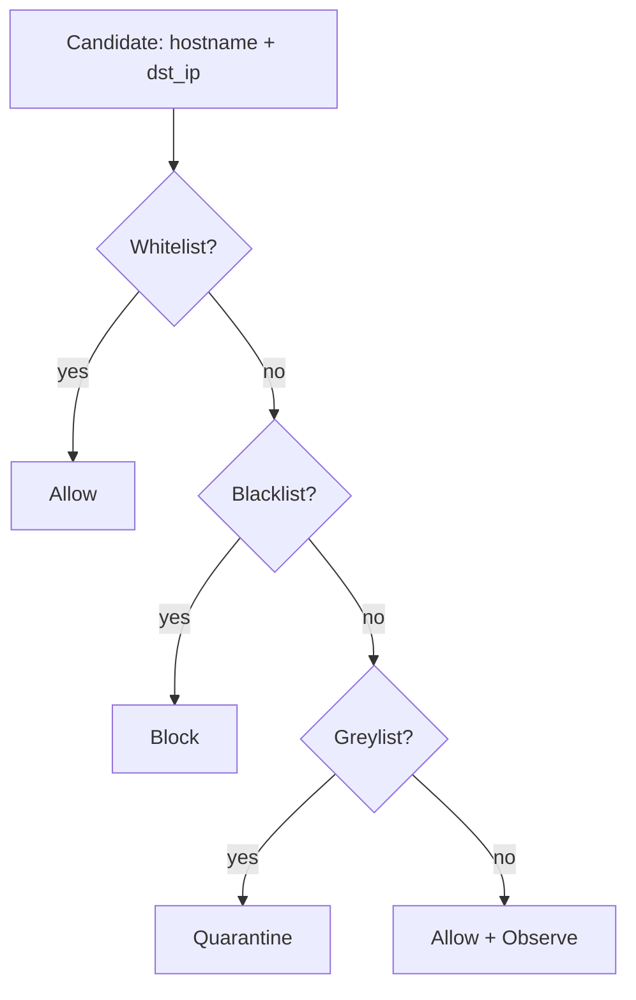
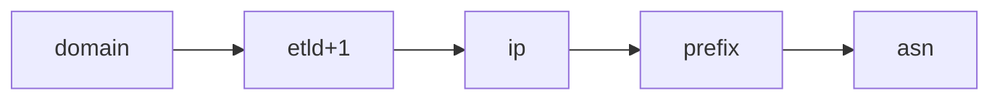

# wire_stripper (enhanced): one SQLite backend, multi-sensor wire stripping, and decentralized ASN/BGP intel

This update extends the original gist with:
- A tighter narrative for why “wire stripping” matters
- Mermaid diagrams (control/data planes, swimlanes, escalation ladder)
- Clarification on **ETL mode**: co-locate DMBT + privacy-proxy tables, then import into canonical tables

---

## Narrative (compressed)

You’re not trying to “block ads”. You’re trying to **control your firehose**.

Wire stripping is the practice of turning high-entropy network activity into:
- **facts** (observations)
- **attribution** (domain → IP → ASN → prefix → entity)
- **policy** (white/grey/black)
- **enforcement** (browser/proxy/OS)
- **federation** (de-identified intel back into an ASN/BGP commons)

The core power is that you stop fighting domains and start governing **ownership + routing reality**.

---

## Single unified SQLite backend

One local SQLite file backs everything:
- wire_stripper canonical: `event`, `domain`, `ip`, `asn`, `prefix`, `list_entry`, `decision`
- DMBT legacy tables (co-located): `ip_map`, `asn_map`, `prefix_map`, `blocklist`, `flow_history`
- Privacy Proxy legacy tables (co-located): `tracking_domains`, `tracking_ips`, `cookie_traffic`, `request_log`, `whitelist`, `fingerprint_rotations`

**Phase 1 (ETL mode)**: do not break legacy tools. Import their tables into canonical.

---

## Diagrams

### Control plane vs data plane

```mermaid
flowchart LR
  subgraph CP[Control plane (low volume)]
    CC[Claude Code (MCP client)]
    MCP[MCP Server: browser tools]
    WS[wire_stripper policy API]
  end

  subgraph DP[Data plane (firehose)]
    S1[Browser sensor events]
    S2[MITM proxy events]
    S3[OS flow events]
    OTEL[OpenTelemetry (OTLP)]
    TUI[otel-tui]
    SPA[SPA dashboard]
  end

  CC -->|tool calls| MCP
  MCP -->|policy hooks| WS

  S1 --> OTEL
  S2 --> OTEL
  S3 --> OTEL

  OTEL --> TUI
  OTEL --> SPA
```

### End-to-end wire stripping (swimlane)



### Policy precedence



### Escalation ladder (avoid collateral damage)



---

## Practical guidance

- Use MCP for **control-plane** actions (start/stop capture, apply policies).
- Use OTLP/OTel for the **firehose** stream so you can view it in a TUI like `otel-tui`.
- Replace per-IP whois lookups with local `pfx2as` LPM before you turn on high-volume flow ingestion.

---

## Repo state (local)

A consolidated repo exists at:
- `D:\somacosf\outputs\wire_stripper`

It contains:
- unified schema: `wire_stripper/db/schema.sql`
- ETL importers: `wire_stripper/etl/import_dmbt.py`, `wire_stripper/etl/import_privacy_proxy.py`
- CLI import commands: `python -m wire_stripper etl import-all --root <data_dir>`

