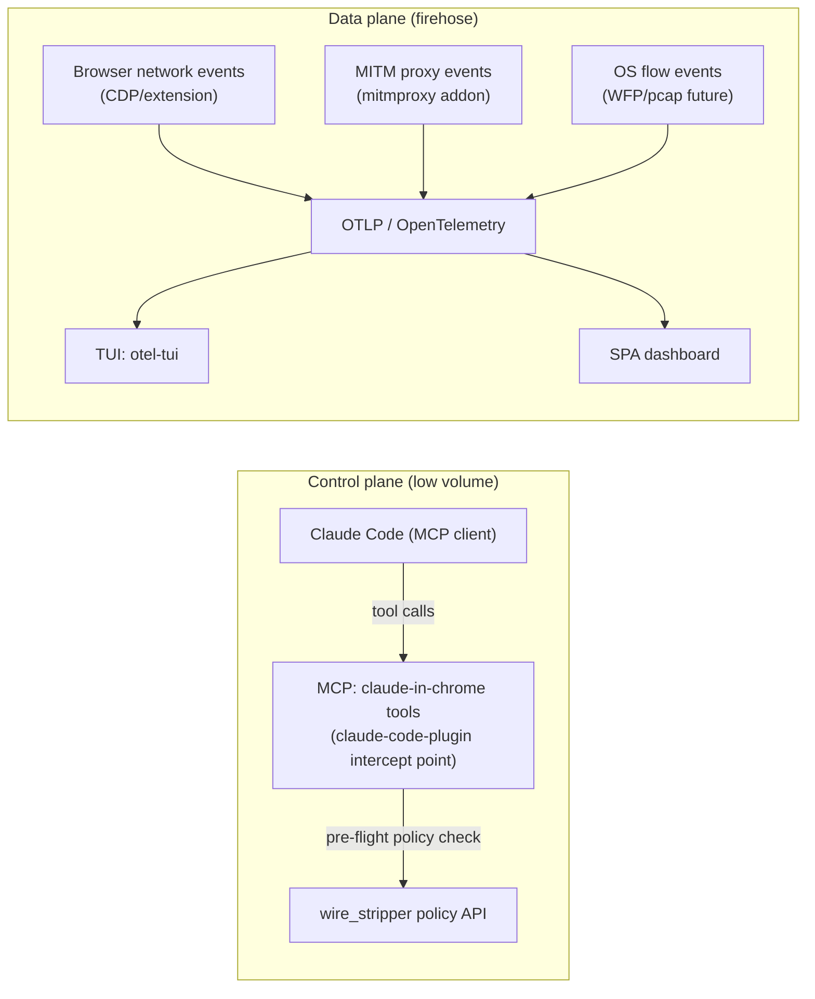
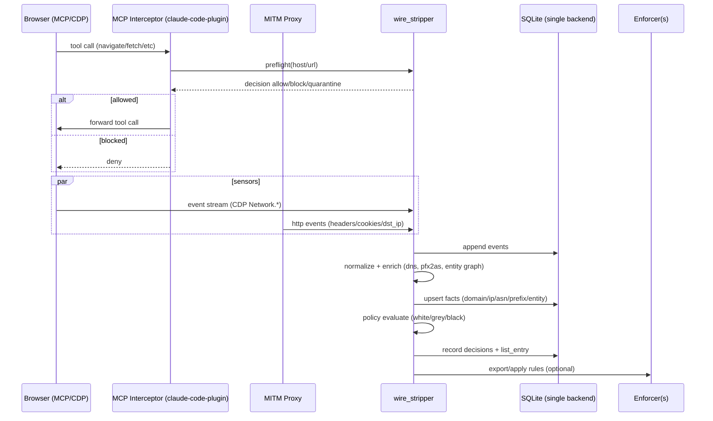
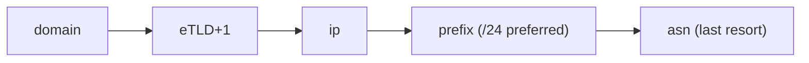
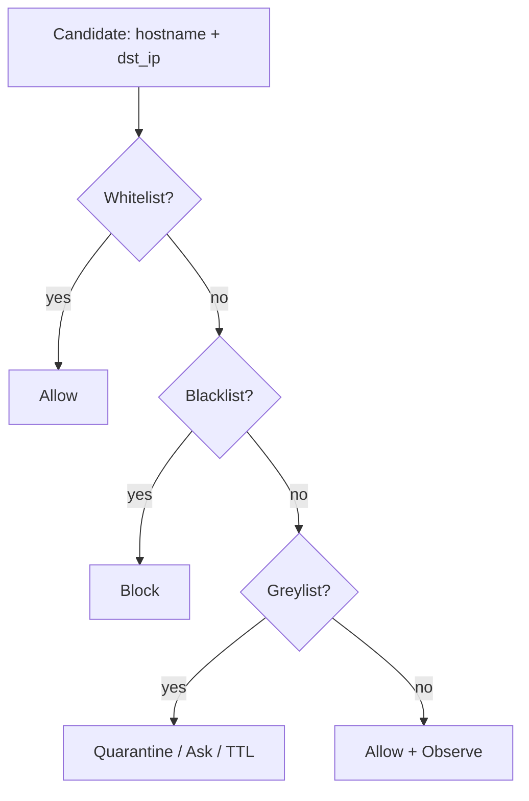

# wire_stripper: control your firehose (DMBT × Privacy Proxy × MCP Browser × OTel)

This gist is a **dense technical amalgamation** of:
- `DMBT`: domain → IP → ASN → prefix mapping + prefix blocklists
- `browser-privacy-proxy`: mitmproxy privacy shaping (cookies/fingerprint/request logging)
- `claude-in-chrome` + `claude-code-plugin`: MCP tool plane for browser control/telemetry (the *control plane tap*)

Goal: a local **wire stripping** system that turns network chaos into:
- **facts** (events)
- **attribution** (domain → IP → ASN → prefix → entity)
- **policy** (white/grey/black)
- **enforcement** (browser rules / proxy mutation / OS firewall)
- **federation** (de-identified intel → shared ASN/BGP commons)

---

## 1) The vision (what you actually get)

You are building a *private perimeter compiler*.

- Every egress/ingress touch becomes a durable event in a local SQLite DB.
- Every event is enriched into routing/ownership reality (ASN/prefix/entity graph).
- Every enriched fact can mint scoped list entries (allow/grey/deny) with explainability.
- List entries are exportable into enforcement adapters (browser/proxy/firewall).
- Safe-to-share intel (entity↔ASN↔prefix↔domain edges) is publishable upstream.

This is not “adblock”. This is “**govern the pipes**”.

---

## 2) Control plane vs data plane (don’t mix)

- **MCP** = control plane (low volume): start capture, apply policy, export rules, request explanations.
- **OTLP/OTel** = data plane (high volume): stream events/metrics/traces to TUI/SPA.

**Why your Mermaid broke before**: GitHub Mermaid doesn’t accept `subgraph ID[Title]`. Use `subgraph ID["Title"]`.

---

## 3) End-to-end wire stripping (swimlane)

---

## 4) Enforcement escalation ladder (minimize collateral)

Rule precedence and escalation:
- Start small; only escalate when evidence density is high.

**Guardrails**
- Never auto-block an entire ASN by default.
- Prefix blocks should be TTL’d and reversible.
- Always keep an allowlist override.

---

## 5) One unified SQLite backend (canonical + legacy co-located)

You asked for **one SQLite3 backend**. Do it.

### Canonical tables (wire_stripper)
- `event`: normalized observations across all sensors
- `domain`, `ip`, `asn`, `prefix`, `entity`: attribution facts
- `list_entry`: policy (white/grey/black by target_type)
- `decision`: explainable evaluation record
- `federation_outbox`: controlled publishing queue

### Legacy tables kept intact (Phase 1 ETL mode)
To avoid breaking your existing tooling on day 1, keep these table names in the same DB:

- DMBT tables: `ip_map`, `asn_map`, `prefix_map`, `blocklist`, `flow_history`
- Privacy Proxy tables: `tracking_domains`, `tracking_ips`, `cookie_traffic`, `request_log`, `whitelist`, `fingerprint_rotations`, `diary_entries`

**ETL mode**: periodically import legacy → canonical.

---

## 6) The critical scaling fix: stop per-IP Cymru lookups

DMBT currently uses Team Cymru per-IP whois. That does *not* scale to a real firehose.

**Required** for viability:
- maintain local `pfx2as` dataset (RouteViews / RIPE RIS)
- do longest-prefix-match locally: `dst_ip → prefix → asn`
- only fall back to Cymru/RIPE when missing

This is the difference between “cool demo” and “always-on edge radar”.

---

## 7) MCP integration: where to modify (`claude-code-plugin`)

Treat `browserbase/claude-code-plugin` as your **MCP interception layer**:

- intercept MCP tool calls targeting the browser tools
- run `wire_stripper` *pre-flight policy* (allow/block/quarantine)
- emit telemetry (OTLP logs/spans) for the control plane
- forward allowed calls to the executor (local Chrome or Browserbase)

This makes the browser tool plane policy-aware and auditable.

---

## 8) Observability: seamless SPA + TUI using OTel

**TUI choice**: `otel-tui` receives OTLP gRPC `:4317` and OTLP HTTP `:4318`.

Emit:
- Logs: one per network event + one per decision
  - `wire.sensor`, `wire.profile_id`, `url.full`, `url.domain`, `net.peer.ip`
  - `wire.decision.action`, `wire.decision.reason`
  - `wire.enrich.asn`, `wire.enrich.prefix`, `wire.enrich.entity`
- Metrics: rates + block ratios
  - `wire_events_total{sensor,action}`
  - `wire_bytes_total{direction,sensor,action}`
- Traces: pipeline spans
  - `wire.ingest`, `wire.enrich`, `wire.policy`, `wire.export`

SPA can either:
- consume the same OTLP pipeline via a tiny local query API, or
- consume a parallel SSE feed produced by wire_stripper (minimal “not a framework” SPA).

---

## 9) Federation: the ASN_BGP_SCAPE

Objective: build a decentralized corpus of:
- `entity` (companies, brokers, subsidiaries)
- `asn`
- `prefix`
- `domain`
- relationships: `entity↔asn`, `asn↔prefix`, `domain↔entity`, `subsidiary_of`, `partner_of`, `cdn_for`

**Privacy rule**: publish *facts* + confidence, not your browsing history.
- No full URLs, no cookie values.
- Prefer aggregated evidence or k-anonymized counts.

Mechanism:
- `federation_outbox` queue with explicit `privacy_level` and signing.

---

## 10) Minimal build order (distilled)

1) **Single SQLite** schema + WAL (done locally)
2) ETL mode imports: legacy → canonical
3) Local `pfx2as` LPM enrichment
4) Policy engine + quarantine flow
5) MCP pre-flight gating in `claude-code-plugin`
6) OTLP emission → `otel-tui` (instant TUI dashboard)
7) Export adapters (chrome rules + firewall plans)
8) Federation outbox + trust/reputation

---

## 11) GitHub Mermaid notes (so it renders)

- Use `subgraph ID["Title"]` (not `ID[Title]`).
- Quote titles that contain punctuation.
- Avoid bare brackets in identifiers.

---

## Appendix: policy precedence

