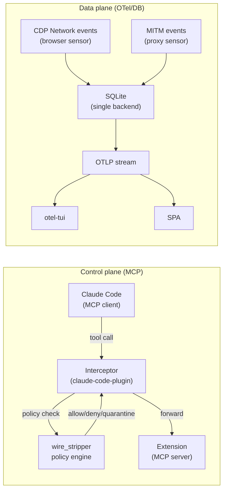
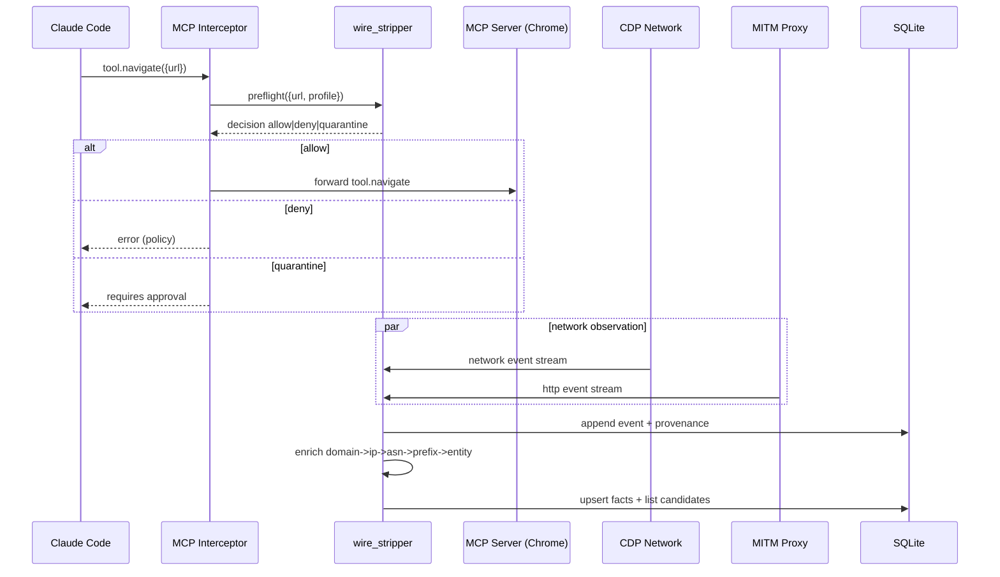
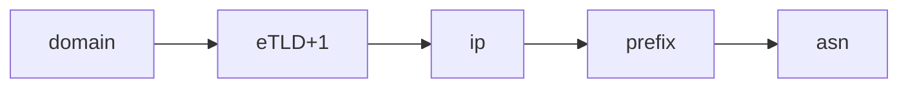

# wire_stripper: the firehose governor (reverse‑engineered MCP-in-browser + DMBT + Privacy Proxy + OTel)

This gist is not a “proxy writeup”. It is a **mechanism**: how to turn the Claude-in-Chrome reverse‑engineering insight into an always-on, local, attribution-grade wire stripper.

## The core insight (from Claude-in-Chrome reverse engineering)

**Claude-in-Chrome is an MCP server living inside the browser boundary.**

That matters because it means:
- the browser is not just a UI; it is a **tool host**
- Claude Code is not “clicking”; it is calling a **typed tool API**
- every action/observation in the browser becomes **structured tool traffic**
- the most valuable interception point is the **MCP transport + tool router**

If you control the tool router, you control:
- what the browser can do (actuation)
- what leaves the browser (observation)
- what data is persisted/filtered/federated (policy)

That is the missing coupling: instead of “proxy sees packets”, you get **intent + context + network**.

---

## 1) Control plane: MCP tool router as your policy choke point

### Mental model
- **MCP server (extension)** exposes tools like: navigate, click, screenshot, read DOM, etc.
- **MCP client (Claude Code)** calls tools with JSON args, receives JSON results.
- **Forwarder/interceptor (claude-code-plugin)** sits between client and server.

### Wire-stripper leverage
Insert a policy engine at the tool router:
- allow / deny / quarantine tool calls
- redact arguments (strip query params, headers, identifiers)
- enforce “least capability” (disable dangerous tools by profile)
- attach provenance (trace IDs, policy rule IDs)

This is what makes the system *stronger than a proxy*:
- A proxy does not know *why* a request happened.
- MCP tool calls + CDP events tell you **who initiated** it, **from what page**, **for what resource type**, and **what the agent intended**.

---

## 2) Data plane: browser network as a sensor stream (not screenshots)

The reverse-engineered extension model gives you a natural sensor surface:
- subscribe to Chrome DevTools Protocol (CDP) network events
  - `Network.requestWillBeSent`
  - `Network.responseReceived`
  - `Network.loadingFinished`
- emit normalized events to a local store

**Key difference vs MITM**
- CDP gives **initiator context** (frame, stack, tab)
- CDP can see traffic even when proxy config is bypassed

---

## 3) The “wire_stripper” amalgamated system (3 objects → 1 machine)

### Objects
- `DMBT` → attribution layer: domain → IP → ASN → prefix, and prefix blocklists
- `browser-privacy-proxy` → HTTP semantics + privacy shaping: cookies, headers, fingerprint surface
- `claude-code-plugin` (+ claude-in-chrome) → MCP control plane interception + browser sensor capability

### Unification principle
**One SQLite DB** holds:
- raw events (facts)
- enrichment (attribution)
- policy (white/grey/black)
- enforcement plans
- federation outbox

---

## 4) Don’t dilute the power: MCP + CDP is the “intent-aware proxy”

If you only build a proxy, you get:
- request/response
- partial IP mapping
- no initiator graph

If you build around MCP-in-browser, you get:
- tool-intent log: *what the agent tried to do*
- DOM/page context: *what state triggered it*
- network graph: *what actually happened*

This enables **contextual filtering**:
- block third-party scripts only when initiated from certain pages
- quarantine requests that look like data broker sync (beacons) regardless of domain rotation
- attach entity/ASN/prefix attribution to events at ingestion time

---

## 5) Planes (keep them separate)

- **MCP** = control plane (low volume): start/stop capture, policy updates, exports
- **OTLP/OTel** = data plane (firehose): events/metrics/traces for TUI + SPA

---

## 6) End-to-end swimlane (what actually runs)

---

## 7) Unified SQLite: canonical tables + legacy co-location (ETL mode)

**Phase 1 (ETL mode)**: keep legacy tables intact, co-located, and import into canonical.
- avoids breaking existing tools
- yields one DB file that can be queried by anything (TUI/SPA/export)

Canonical (wire_stripper):
- `event`, `domain`, `ip`, `asn`, `prefix`, `entity`, `list_entry`, `decision`, `federation_outbox`

Legacy co-located:
- DMBT: `ip_map`, `asn_map`, `prefix_map`, `blocklist`, `flow_history`
- Privacy Proxy: `tracking_domains`, `tracking_ips`, `cookie_traffic`, `request_log`, `whitelist`, `fingerprint_rotations`

---

## 8) The scaling cliff: per-IP whois must die (replace with pfx2as LPM)

To make this always-on:
- build or import a local `pfx2as` table
- do longest-prefix match locally
- use Cymru/RIPE only as fallback

Without this, your firehose ingestion will stall.

---

## 9) Enforcement ladder (avoid self-DOS)

Rules:
- auto-block at `domain/eTLD+1` aggressively
- block `ip/prefix` conservatively with TTL and allow overrides
- treat `asn` blocks as “nuclear option”

---

## 10) ASN_BGP_SCAPE federation (decentralized lists, not centralized spying)

Publish only what is safe:
- entity/ASN/prefix relationships
- domain classification + confidence
- aggregated evidence, not raw URLs

Mechanism:
- `federation_outbox` → signed batches → peers

---

## 11) GitHub Mermaid rendering rules (so this doesn’t break again)

- Use `subgraph ID["Title"]` (titles quoted)
- Avoid special characters in node IDs; put punctuation in labels instead
- Keep arrows simple: `-->` and `-- text -->`

---

## TL;DR

The power is not “a proxy”.

The power is:
- MCP-in-browser = **tool host**
- claude-code-plugin = **router/interceptor**
- CDP events = **contextual sensor**
- DMBT = **routing attribution**
- unified SQLite = **local truth**
- OTel = **multi-surface visibility (TUI + SPA)**
- federation = **ASN_BGP_SCAPE**
